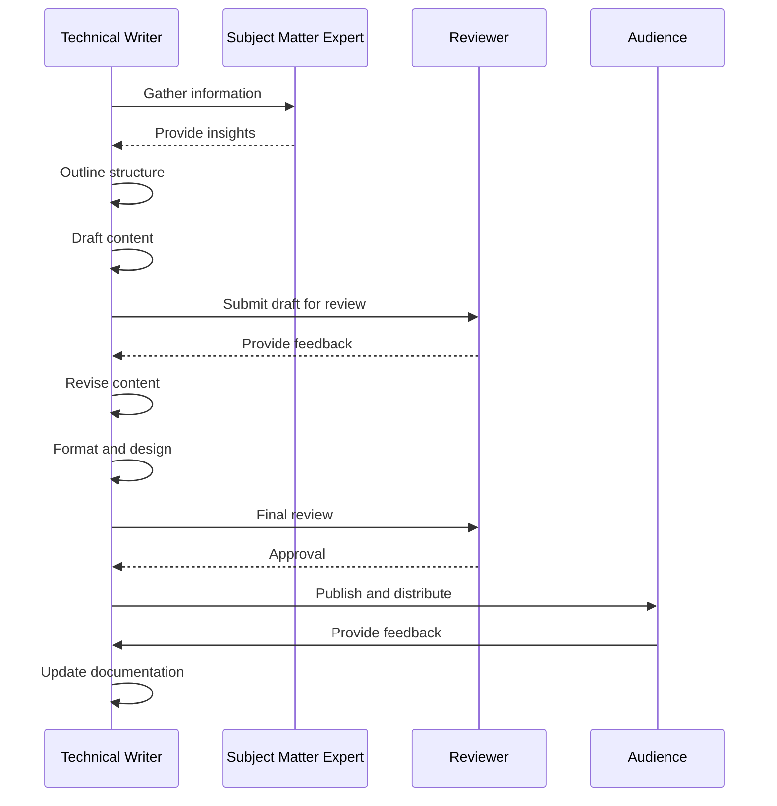

# Process of Writing a Technical Documentation

```mermaid
sequenceDiagram
    participant TechnicalWriter as Technical Writer
    participant SME as Subject Matter Expert
    participant Reviewer
    participant Audience

    TechnicalWriter->>SME: Gather information
    SME-->>TechnicalWriter: Provide insights
    TechnicalWriter->>TechnicalWriter: Outline structure
    TechnicalWriter->>TechnicalWriter: Draft content
    TechnicalWriter->>Reviewer: Submit draft for review
    Reviewer-->>TechnicalWriter: Provide feedback
    TechnicalWriter->>TechnicalWriter: Revise content
    TechnicalWriter->>TechnicalWriter: Format and design
    TechnicalWriter->>Reviewer: Final review
    Reviewer-->>TechnicalWriter: Approval
    TechnicalWriter->>Audience: Publish and distribute
    Audience->>TechnicalWriter: Provide feedback
    TechnicalWriter->>TechnicalWriter: Update documentation
```

